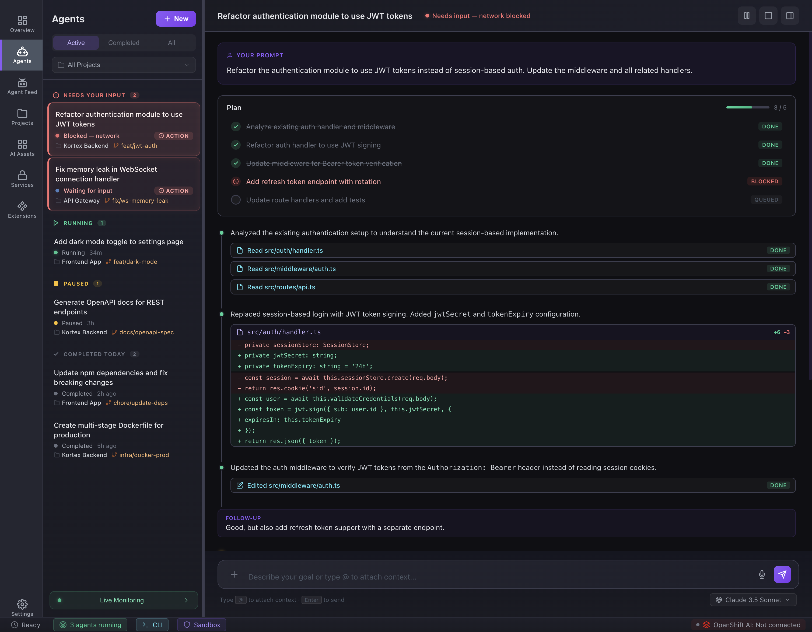

# Feature: Agent sessions list

**Parent epic:** [Epic: Agents](./epic-agents.md)

### Problem

As a user, I need to see all coding agent workspaces at a glance and open or create one without hunting through the filesystem or external tools.

### Solution (capabilities)

- List sessions with provider/visual identity, title, status, and last activity.
- Group or section the list when it helps scanability (mockup uses section headers).
- Primary path to **create** a new coding agent workspace.
- Row opens session detail / workspace.

**Mockup:** [`sessions/index.html`](../../sessions/index.html)

### Visual reference

*Note: if the list layout diverges from this capture, replace or add a screenshot under `website/` and update this path.*

### Priority

- **P0:** List, open session, create CTA.
- **P1:** Search/filter, empty state—if present in mockup, keep in sync when we change HTML.

## Sub-tasks

- [ ] List API or static data model matches row fields (title, subtitle, status, provider).
- [ ] Navigation: sidebar **Agents** highlights; deep link from other pages works.
- [ ] Create flow entry point routes to `sessions/create.html` (or equivalent route).
- [ ] Accessibility: row focus, keyboard activation, meaningful labels for status.

## Related

- [Create agent workspace](./feature-create-agent-workspace.md)
- [Session workspace](./feature-agent-session-workspace.md)
