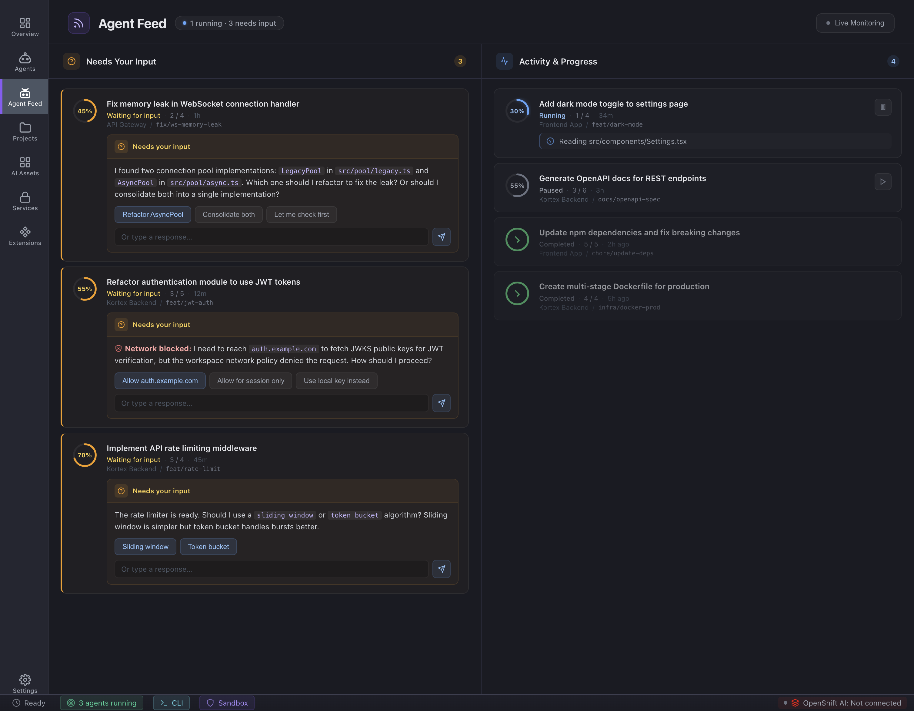

# Feature: Alerts & activity feed

**Parent epic:** [Epic: Agents](./epic-agents.md)

### Problem

When several agents run at once, approvals and progress updates drown in chat. We need a dedicated surface that separates **blocking questions** from **background activity**.

### Solution (capabilities)

- Two columns: **Needs your input** (questions, approvals, policy decisions) and **Activity & progress** (runs, steps, terminal-linked work).
- Header shows **Alerts** title, aggregate badge (e.g. live count), and optional **Live Monitoring** toggle that simulates or streams updates (mockup uses timed demo events).
- Cards show agent identity, status pill, timestamps, optional progress, and action buttons for interactive items.

**Mockup:** [`agent-feed/index.html`](../../agent-feed/index.html)

### Visual reference

## Sub-tasks

- [ ] Feed merges events from multiple sessions with stable ordering (newest first or policy TBD).
- [ ] “Needs input” items expose primary/secondary actions that map to backend decisions (allow/deny, answer)—exact API TBD.
- [ ] Live monitoring: start/stop without duplicating subscriptions; definition to be refined for real-time transport.
- [ ] Empty states for each column when no items.

## Related

- [Agent sessions list](./feature-agent-sessions-list.md)
- Overlay pattern in [`assets/css/styles.css`](../../assets/css/styles.css) (`.agent-feed-overlay`) if we embed feed outside full page—keep spec in sync if we consolidate.
