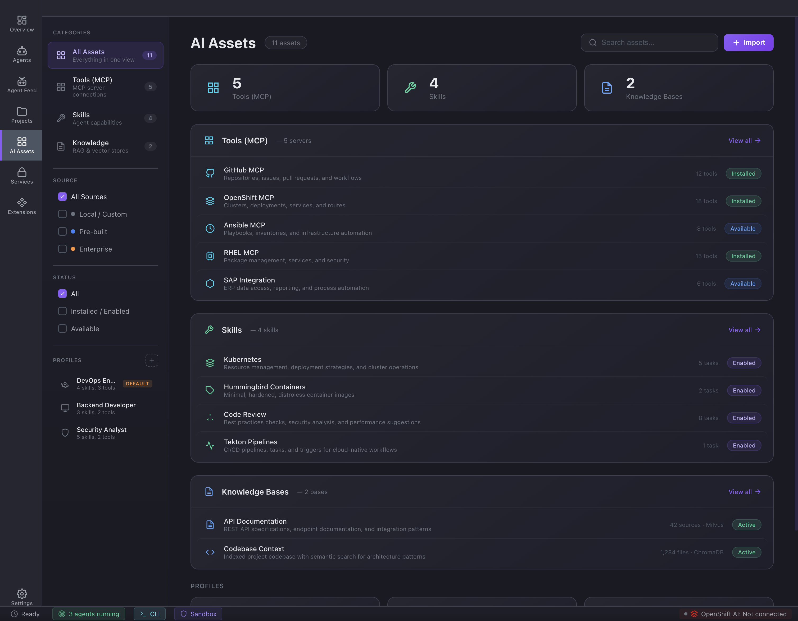

# Feature: Project workspace (detail sections)

**Parent epic:** [Epic: Projects](./epic-projects.md)

### Problem

Project-level defaults must be discoverable and editable in one shell: what agents can do, what they can read, and how secrets attach—without opening five different tools.

### Solution (capabilities)

Left nav sections (per mockup):

| Section | Intent |
|--------|--------|
| **Overview** | Summary stats (e.g. running agents), quick signals, project settings entry. |
| **Skills** | Agent capabilities attached to this project (count badge in nav). |
| **MCP Servers** | Tool connections (count in nav). |
| **Knowledge** | RAG / vector stores (count in nav). |
| **Secrets & Tokens** | Credentials & integrations for this project—references into Secret Vault, not ad-hoc paste. |
| **Filesystem** | Paths, mounts, access rules. |
| **Network Policy** | Outbound allow/deny posture. |

**Mockup:** [`projects/details.html`](../../projects/details.html)

### Visual reference

*This capture is from the marketing gallery; replace with a projects detail screenshot when available.*

## Sub-tasks

- [ ] Section switcher updates URL or state for deep-linking (e.g. `#secrets`).
- [ ] Overview **Running agents** list links to [Agent session workspace](../agents/feature-agent-session-workspace.md) where applicable.
- [ ] **Secrets & Tokens** rows use vault references; masked labels; link to `services/` vault UI.
- [ ] Skills / MCP / Knowledge panels stay consistent with their standalone index pages (`skills/`, `mcp/`, `knowledges/`) for naming and icons.
- [ ] Filesystem & network sections: validation and preview of rules—detail level TBD with engineering.

## Related

- [Secret Vault inventory](../secret-vault/feature-vault-inventory.md)
- [Agents: create workspace](../agents/feature-create-agent-workspace.md)
